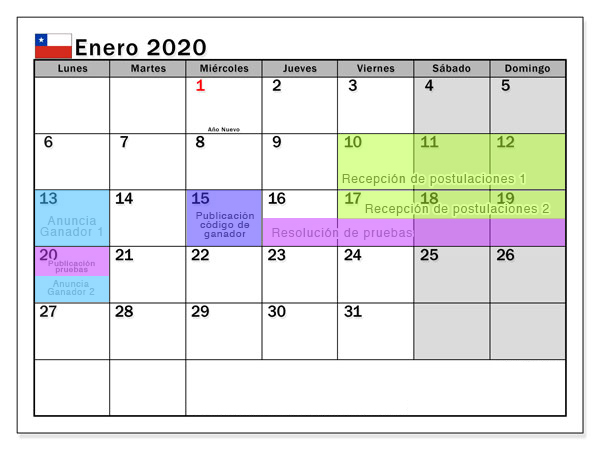

# Testing Summer con Angular Chile
Es una iniciativa de la comunidad **Angular Chile** para fomentar el aprendizaje y uso de testing en los procesos de desarrollos de aplicaciones con Angular.

## ¿Que es Testing Summer Angular?
Tú compartes tu código, nosotros escribimos [pruebas unitarias](https://es.wikipedia.org/wiki/Prueba_unitaria) y [pruebas de integración](https://es.wikipedia.org/wiki/Prueba_de_integraci%C3%B3n). Al final del proceso compartimos los resultados con la comunidad y fomentamos el aprendizaje conjunto.  
Al final del ciclo publicaremos artículos y/o videos explicando los conceptos relacionados a las soluciones publicadas.

## ¿Cómo participar?
1. Realizaremos una comunicación vía Twitter o Facebook sobre las fechas de postulación.
2. Los postulantes indicar su interés de participación enviando un mensaje privado por redes sociales.
3. Se realizará un sorteo semanal sobre todas las postulaciones enviadas.
4. Se elije el ganador y se notifica por comunicación interna. Esto puede ser vía mensaje privado de Twitter, Facebook o correo electrónico.
5. Se publican los resultados de selección por las redes sociales de **Angular Chile**.
6. El equipo de **Angular Chile** enviará el código con los casos de testing aplicados y se harán públicos al resto de la comunidad.

## Calendarios

## Y si gano, ¿Qué tengo que hacer?
Sigue [esta guía](/PASOS.md) para mayor información

## Bases
* **Angular Chile** esta habilitado para utilizar este código de forma pública. Es por eso que debes realizar la publicación  de tu código lo más limpia y anónima posible (sin datos que identifiquen tus proyectos personales o de tu institución).

* Todo el código contenido en Stackblitz una vez sean resueltos los ejercicios será publicado en un repositorio que anunciaremos oportunamente.

## No dejes de participar :tada:
Esperamos poder tener una gran base de conocimientos de tests y que podamos compartir con todos uds. estos conocimientos!!